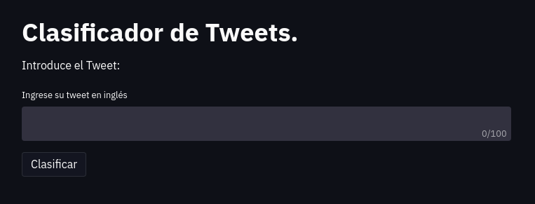
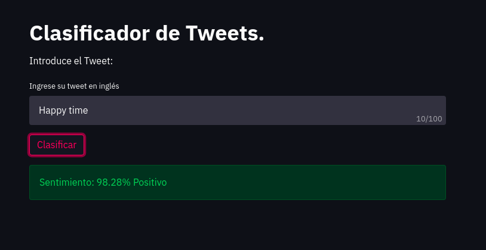

---

# Clasificador de Tweets en inglés
Utilizando Conv1D se desarrolló un clasificador del sentimiento de Tweets en inglés.

Se creó una plataforma que permite ingresar el Tweet en inglés y luego clasificar el
sentimiento.

---

## Construcción del proyecto

Para este proyecto se utilizaron las siguientes herramientas:

* [Streamlit](https://streamlit.io/) - Framework web usado
* [Tensorflow](https://www.tensorflow.org/) - Librería para desarrollar modelos de ML.

---

## Instalación

Para iniciar el proyecto es necesario instalar las dependencias de la siguiente forma:

```
pip install -r requirements.txt
```

Al finalizar la instalación ejecutamos la aplicación con el siguiente comando:

```
streamlit run main.py
```

_Luego de iniciada la plataforma podrás clasificar el sentimiento de tus Tweets en inglés._

---

## Probar la plataforma

Al iniciar la plataforma observarás un recuadro donde podrás ingresar tu Tweet en inglés.



Luego de ingresar el texto podrás presionar en el botón de _"Clasificar"_ e iniciará el proceso de
clasificación de sentimiento.




_Repitiendo este proceso, podrás clasificar todos los Tweets en inglés que desee._

---

## Comentarios finales

* El traductor solo clasifica Tweets en inglés, no es capaz de traducir Tweets en español.
* El modelo solo fue entrenado por 15 épocas, por lo tanto aún tiene un amplio margen de mejora.

---

## Autor

* **Argenis Gómez** - *Desarrollo del proyecto* - Github: [argenis-gomez](https://github.com/argenis-gomez)

---